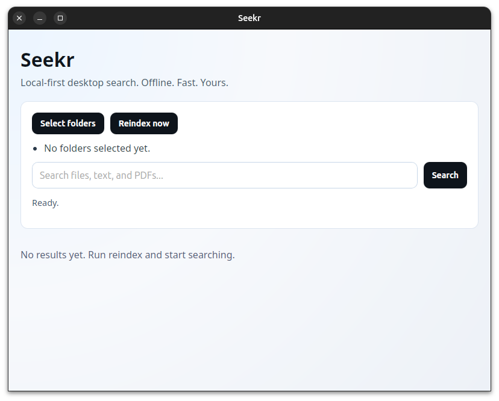

# Seekr

Seekr is a free, local-first desktop search app built with Tauri + Rust + React.



It indexes files on your machine and searches fully offline. No cloud, no telemetry, no external APIs, no paid services.


## Features (v1)

- Desktop app (Tauri v2)
- Local-only indexing and search
- User-selected index folders
- Search across:
  - file names
  - `.txt`
  - `.md`
  - `.pdf` (text extraction)
- Result list shows:
  - title / filename
  - full path
  - snippet preview with highlighted match
  - file type
  - last modified time
- Open result with system default app
- Excludes noisy folders:
  - `.git`, `node_modules`, `dist`, `target`, `venv`, `__pycache__`
- Incremental updates via file watcher
- Works offline

## Stack

- Desktop shell: Tauri v2
- Backend: Rust
- Index and search: SQLite + FTS5 (`rusqlite`)
- File crawling: `walkdir`
- File watching: `notify`
- PDF extraction: `pdf-extract`
- Frontend: React + Vite + TypeScript

## Architecture

- Frontend (`src/`): UI, folder selection, reindex/search actions
- Backend (`src-tauri/src/`):
  - `lib.rs`: Tauri commands and app wiring
  - `db.rs`: schema + DB helpers
  - `config.rs`: index root persistence
  - `crawler.rs`: full crawl + indexing logic
  - `watcher.rs`: incremental file updates
  - `search.rs`: FTS query + ranking
  - `pdf.rs`: PDF text extraction wrapper

### Data model

- `indexed_files`
  - canonical file path (unique)
  - title
  - extension
  - modified/index timestamps
  - full extracted text content
- `indexed_files_fts` (FTS5 virtual table)
  - indexed `path`, `title`, `content`
  - `bm25` ranking
  - snippet generation with `<mark>` highlights
- `indexed_roots`
  - user-configured root folders

## Local setup

### 1. System prerequisites (Linux)

Install Tauri Linux deps (Ubuntu 24.04 example):

```bash
sudo apt-get update
sudo apt-get install -y \
  libwebkit2gtk-4.1-dev \
  libjavascriptcoregtk-4.1-dev \
  libsoup-3.0-dev \
  libgtk-3-dev \
  libayatana-appindicator3-dev \
  librsvg2-dev
```

### 2. Toolchains

- Node.js 20+
- npm
- Rust stable

### 3. Install and run

```bash
npm install
cargo check --manifest-path src-tauri/Cargo.toml
npm run tauri dev
```

## Usage

1. Click `Select folders`
2. Choose one or more directories
3. Click `Reindex now`
4. Search with the main search field
5. Click `Open file` on a result to open with your default app

## Commands implemented

- `init_backend`
- `get_index_roots`
- `set_index_roots`
- `run_full_reindex`
- `search_index`

## Tradeoffs and known limitations

- PDF support is best-effort. Some PDFs (scanned/image-only or unusual encodings) may not extract text. Seekr skips those files instead of failing the whole index.
- Initial indexing is full crawl. Incremental updates are watcher-based after that.
- Watchers are active for currently saved roots; changing roots resets watcher set.
- Search is lexical FTS5 only (no embeddings/AI).
- v1 focuses on `txt`, `md`, `pdf`; other formats are out of scope.

## Privacy

- All data stays local.
- No telemetry.
- No network API dependencies in runtime behavior.

## Project status

MVP is implemented and builds with:

- `npm run build`
- `cargo check` (in `src-tauri`)

