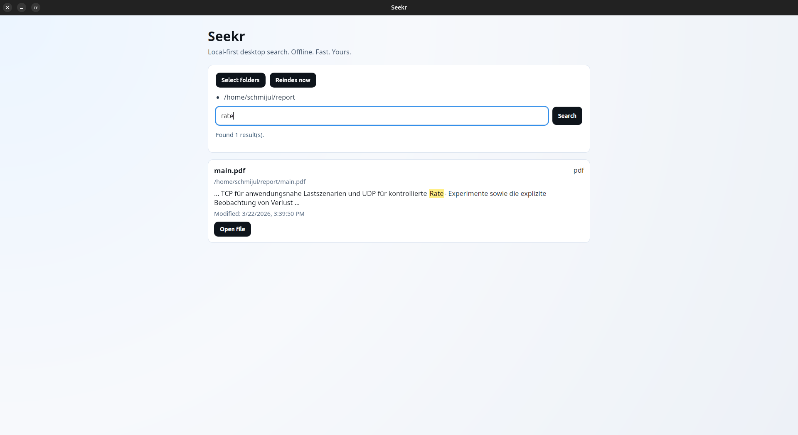

# Seekr

Seekr is a local code retrieval engine for coding agents and humans.




It indexes code and documentation on your machine and searches fully offline. No cloud, no telemetry, no external APIs, no paid services.

## Features

- Desktop app (Tauri v2)
- Local-only indexing and search
- User-selected index folders
- Search across:
  - file names
  - code chunks
  - symbols
  - `.md`
  - common source files such as `.rs`, `.ts`, `.tsx`, `.js`, `.jsx`, `.py`, `.go`, `.java`, `.kt`, `.json`, `.yaml`, `.yml`, `.toml`
- Result list shows:
  - title / filename
  - full path
  - snippet preview
  - file type / language
- Open result with system default app
- Excludes noisy folders via ignore rules
- Snapshot indexing plus incremental watcher support
- Works offline

## Stack

- Desktop shell: Tauri v2
- Backend: Rust
- Index and search: SQLite metadata + Tantivy text index
- File crawling: `walkdir`
- Ignore handling: `ignore`
- File watching: `notify`
- Code/file hashing: `sha2`
- Time handling: `chrono`
- Frontend: React + Vite + TypeScript

## Architecture

- Frontend (`src/`): UI, folder selection, reindex/search actions
- Backend (`src-tauri/src/`):
  - `lib.rs`: Tauri commands and app wiring
  - `core/workspace.rs`: workspace identity and repo metadata
  - `core/scanner.rs`: file discovery, ignore rules, file classification
  - `core/parser.rs`: chunking and lightweight symbol extraction
  - `core/index_store.rs`: SQLite schema and persistence helpers
  - `core/text_index.rs`: Tantivy document build and search
  - `core/ingest.rs`: snapshot indexing workflow
  - `core/query.rs`: text, symbol, chunk, and error lookup APIs
  - `core/lsp.rs`: LSP capability scaffold
  - `watcher.rs`: incremental file updates

### Data model

- `workspaces`
  - workspace root and repository metadata
- `files`
  - file path, language, hash, timestamps, parsed content
- `chunks`
  - line windows for code retrieval
- `symbols`
  - lightweight definition records
- `references`
  - reference lookup scaffold
- `index_errors`
  - per-file and per-job failures

## Local setup

### 1. System prerequisites (Linux)

Install Tauri Linux deps (Ubuntu 24.04 example):

```bash
sudo apt-get update
sudo apt-get install -y \
  libwebkit2gtk-4.1-dev \
  libjavascriptcoregtk-4.1-dev \
  libsoup-3.0-dev \
  libgtk-3-dev \
  libayatana-appindicator3-dev \
  librsvg2-dev
```

### 2. Toolchains

- Node.js 20+
- npm
- Rust stable

### 3. Install and run

```bash
npm install
cargo check --manifest-path src-tauri/Cargo.toml
npm run tauri dev
```

## Usage

1. Click `Select folders`
2. Choose one or more directories
3. Click `Reindex now`
4. Search with the main search field
5. Click `Open file` on a result to open with your default app

For larger codebases, prefer:
1. a single local monorepo root
2. a clean reindex first
3. focused searches by symbol name, filename fragment, or unique string

## Commands implemented

- `init_backend`
- `open_workspace`
- `get_workspace_status`
- `start_snapshot_index`
- `search_text`
- `search_symbols`
- `lookup_definition`
- `find_references`
- `get_chunk`
- `get_file_excerpt`
- `list_recent_index_errors`
- `get_index_roots`
- `set_index_roots`
- `run_full_reindex`
- `search_index`

## Tradeoffs and known limitations

- Snapshot indexing is implemented first; incremental watcher handling is present but still basic.
- Symbol extraction is heuristic in the current backend and Tree-sitter/LSP are not fully wired yet.
- Search is lexical plus structured retrieval, but not embeddings-first.
- The codebase currently favors a single local monorepo over multi-repo workspace support.

## Privacy

- All data stays local.
- No telemetry.
- No network API dependencies in runtime behavior.

## Project status

Current build status:

- `npm run build`
- `cargo check` (in `src-tauri`)
